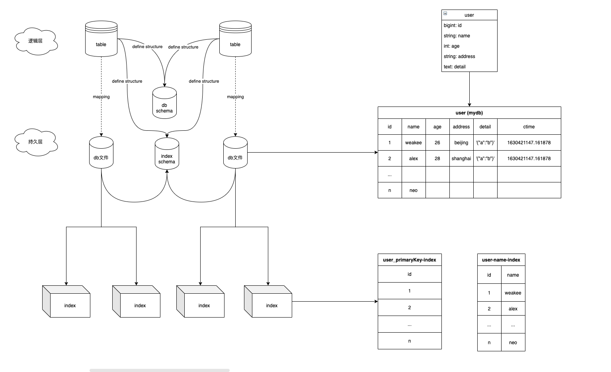

# MyDb
awesome db create myself database

## 实现一个数据库玩玩
### 架构图

- 其实我认为一个简单的数据库，可以当作一个B树，通过合理的使用B树即可完成一个数据库的实现
- 依赖的B树处理逻辑，采用了开源项目 [NicolasLM/bplustree](https://github.com/NicolasLM/bplustree)
- 画图使用了drawio，原文件存放在    `mydb/static/MyDB-数据库设计.drawio`

### server
- 通过tcp来接受请求
  
### table
- 具体的数据表操作

### client
- 真正操作数据库的客户端